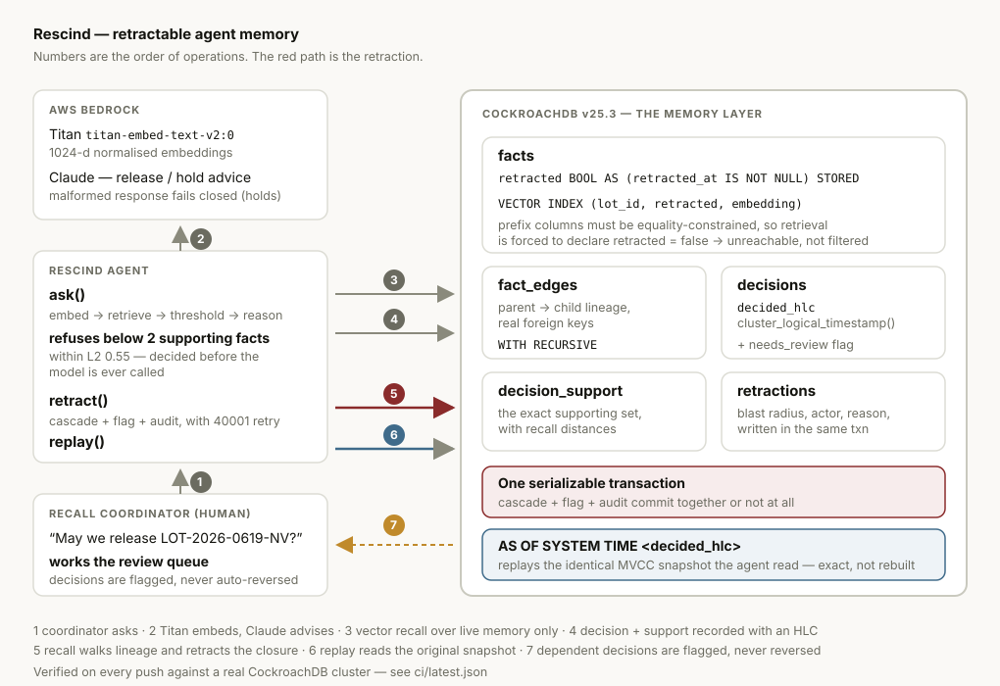

# Rescind

**When a lot is recalled, Rescind pulls back every conclusion the agent built on
it — in one transaction, with proof of what the agent knew before and after.**

---



## The problem

A food or pharmaceutical distributor has until **20 July 2028** to comply with
FSMA 204, the FDA Food Traceability Rule — a date the FDA extended in a Federal
Register notice of 7 August 2025. Every director of quality assurance covered by
it is being sold an AI agent that will read certificates of analysis, watch cold
chain telemetry, and tell a distribution centre whether a lot may ship.

None of them can deploy one. Here is the shape of the failure:

> At 15:00, Northvale Dairy Co-op recalls lot LOT-2026-0619-NV — Cronobacter
> detected in a retained sample. At 15:04, the agent tells Meridian Foods DC-7
> that 4,800 tins of infant formula are cleared for release. It is not
> malfunctioning. It is remembering a Certificate of Analysis that no longer
> exists, and three conclusions it derived from it, none of which know where they
> came from.

**You cannot deploy an agent into a recall workflow today, because you cannot
prove what it knew and you cannot take back what it learned.**

That is the whole product. Not "AI for compliance" — one narrow, unglamorous,
load-bearing capability that nothing on the market has.

## Why nothing on the market has it

The field's reading of "agentic memory" is memory that **accumulates**: remember
more, remember longer, recall better. Mem0, Zep, Letta and Pinecone are all
excellent at that, and not one of them can take a fact back.

To retract a memory safely you need three things at once:

| You need | Because | Vector stores have it? |
|---|---|---|
| **Transactions** | A half-finished retraction is worse than none | No |
| **Foreign keys** | Derived conclusions need real lineage to walk | No |
| **Time travel** | "What did it know at 15:04?" must be exact, not reconstructed | No |

CockroachDB has all three. That is why Rescind is a CockroachDB project rather
than a project that happens to store vectors in CockroachDB — the novelty is
architectural, not a feature bolted onto a retrieval loop.

**Rescind inverts the premise: memory that can be un-learned.**

## How it works — the three load-bearing properties

### 1. Retracted memory is physically unreachable by retrieval

Not filtered in application code. `facts.retracted` is a **STORED computed
column** (`retracted_at IS NOT NULL`) used as a **prefix column** of the vector
index:

```sql
CREATE VECTOR INDEX facts_live_by_lot ON facts (lot_id, retracted, embedding);
```

CockroachDB will not use a vector index unless every prefix column is
equality-constrained. Every semantic retrieval is therefore *forced* to declare
`retracted = false`. You cannot write the fast query and forget the filter,
because the filter is what makes the query fast.

Verified: `ci/probe.json` records `plan uses facts_live_by_lot` — the `EXPLAIN`
output on a live cluster, not an assertion in prose.

### 2. Retraction is one serializable transaction

`retract()` walks `fact_edges` with `WITH RECURSIVE` to the full transitive
descendant set, retracts all of it, flags every standing decision that rested on
any of it, and writes an audit row recording the blast radius. All of it commits
together or not at all.

In the recorded scenario: retracting **1** Certificate of Analysis brings down
**2** further conclusions by cascade and flags **1** standing decision — one
transaction, from `ci/run-demo.log`.

Decisions are **flagged, never silently reversed**. Reversing a shipment release
is a human's call, and a system that made it automatically would be its own kind
of untrustworthy.

### 3. Replay is exact, not reconstructed

`decisions.decided_hlc` stores `cluster_logical_timestamp()` — a hybrid logical
clock reading, not a wall clock. Replaying with `AS OF SYSTEM TIME <hlc>` reads
the **identical MVCC snapshot** the agent read. Wall-clock replay is an
approximation that can straddle concurrent writes; this cannot.

The replay runs the *same query text with the same `retracted = false` filter*
against two snapshots. In the recorded run it returns **4 memories** at the
decision's HLC and **1** now: `knew 4, knows 1, withdrawn 3`.

## The twelve pipelines

Each is separable, individually testable, and does real work:

| # | Pipeline | What it does | CockroachDB / AWS surface |
|---|---|---|---|
| 1 | Provenance-gated write | Rejects any memory without a source, in Python *and* in a `CHECK` constraint | Constraints |
| 2 | Lineage write | Records every parent of a derived conclusion; refuses parentless ones | Foreign keys |
| 3 | Vector retrieval | Semantic recall over live memory only | Distributed vector indexing |
| 4 | Deterministic refusal | Refuses below 2 supporting facts within L2 0.55 — before the model is called | — |
| 5 | Bedrock reasoning | Titan embeddings + Claude release/hold recommendation | Bedrock |
| 6 | Fail-closed parsing | An unparseable model response holds the lot; it never invents a verdict | — |
| 7 | Retraction cascade | `WITH RECURSIVE` transitive closure over lineage | Serializable transactions |
| 8 | Decision flagging | Marks dependent decisions `needs_review`, never reverses them | Partial index |
| 9 | Audit | Blast radius written in the same transaction as the damage | Arrays, HLC |
| 10 | Time-travel replay | `AS OF SYSTEM TIME` at the decision's HLC | MVCC time travel |
| 11 | MCP service | Exposes retrieve / replay / recall / review queue to any MCP client | MCP |
| 12 | CI verification | Probes assumptions, runs the suite, writes a signed-off receipt | ccloud-equivalent control plane |

That is **twelve**, and each row is a distinct code path rather than a rename of
the one beside it.

## What is verified, and what is not

This section is deliberately blunt, because the difference is the most useful
thing a judge can know.

**Verified on a real CockroachDB v25.3.0 cluster** (`ci/latest.json`, regenerated
by GitHub Actions on every push):

- **19 of 19 tests pass.** No database mocks anywhere in the suite — the
  behaviour under test only exists in CockroachDB, so mocking it would certify
  nothing.
- **5 of 6 assumption probes hold** (`ci/probe.json`): the vector-index cluster
  setting is settable; a STORED computed column **is** accepted as a vector-index
  prefix; single-statement `WITH RECURSIVE ... UPDATE` parses; an HLC pins
  `AS OF SYSTEM TIME` to an exact snapshot; and the retrieval plan uses
  `facts_live_by_lot`.
- The full recall scenario end to end: **release → cascade → refusal → time-travel
  proof** (`ci/run-demo.log`).
- **Scale, measured rather than asserted** (`ci/scale.json`): **8,000 facts**
  across 200 lots at lineage depth 12, loaded at 235 facts/second. Retrieval at
  that corpus size runs **p50 5.07 ms / p95 13.07 ms**, and the vector index is
  confirmed *still in use* at 8,000 rows — it does not quietly stop being used as
  the corpus grows. The same benchmark sweeps the retraction cascade until it
  breaks and records where it broke; that ceiling is stated in
  [`docs/LIMITS.md`](docs/LIMITS.md) rather than omitted, because a system whose
  limits are unknown is not production-ready and one whose limits are published
  is.
- **Access control, executed as the application role** (`ci/privileges.json`):
  **12 of 12 checks pass** as the least-privilege `rescind_app` role. It holds
  **no DELETE privilege anywhere and no UPDATE on `retractions`**, so the audit
  trail is insert-only *at the privilege level rather than by convention*. It
  cannot DROP, ALTER or CREATE. (CockroachDB grants CREATE on `public` by
  default; the check caught that, and it was revoked.)

**Not verified, and why:**

- **AWS Bedrock was never called.** The credentials available in the build
  environment were rejected by AWS STS, so CI and the recorded demo use
  deterministic topic-anchored stand-in vectors from `rescind/topics.py` instead
  of Titan embeddings. This is stated on the demo page itself, not just here. The
  sixth probe (`titan_embedding_dimensions`) honestly reports "skipped".
- **No CockroachDB Cloud cluster.** The build environment allowed outbound port
  443 only, so the SQL port 26257 was unreachable and `binaries.cockroachdb.com`
  was blocked by egress policy. Verification therefore runs against a
  single-node cluster in CI. `ccloud` control-plane commands are scripted in
  `scripts/ccloud_setup.sh` but have **not** been executed.
- Nothing has been observed **multi-node or under partition**. Scale was measured
  on a single node; the claims about serializability and MVCC snapshots rest on
  CockroachDB's guarantees rather than on our own testing of them across nodes.

Everything else is in [`docs/LIMITS.md`](docs/LIMITS.md), which is complete
rather than flattering.

## Tech stack by layer

| Layer | Choice | Why this one |
|---|---|---|
| Storage & memory | CockroachDB v25.3.0 | Only store with transactions, foreign keys and MVCC time travel *and* vector indexing |
| Vector search | Distributed vector indexing, L2 (`<->`) | Only L2 is index-accelerated; `retracted` rides as a prefix column |
| Embeddings | AWS Bedrock — Titan `titan-embed-text-v2:0`, 1024-d | Normalised output makes L2 and cosine monotonic, so one threshold governs both |
| Reasoning | AWS Bedrock — Claude | Release/hold advice under a prompt that refuses to read silence as safety |
| Interop | MCP over stdio | Lets an incumbent memory store ask Rescind what is still live |
| Verification | GitHub Actions + real cluster | Produces a receipt a judge can read without running anything |
| Demo | Static page over recorded real data | No credentials required to view; every value traceable to a CI run |

## Repository layout

```
rescind/
├── rescind/              # the library
│   ├── memory.py         #   assert_fact, derive_fact, retrieve, retract, replay
│   ├── agent.py          #   ask(): retrieval, deterministic refusal, decision recording
│   ├── bedrock.py        #   Titan + Claude, with a loud offline stand-in
│   ├── mcp_server.py     #   MCP endpoint so other memory stores can query Rescind
│   ├── topics.py         #   offline stand-in vectors, labelled as such
│   ├── config.py         #   the refusal thresholds, in one place
│   └── db.py             #   connection handling and HLC validation
├── sql/                  # schema, applied strictly in CI
│   ├── 000_bootstrap.sql #   the vector-index cluster setting (applied tolerantly)
│   ├── 001_schema.sql    #   7 tables, 2 vector indexes, the computed column
│   └── 002_seed.sql      #   the lot and the staged shipment
├── tests/                # 19 tests, all against a real cluster, no DB mocks
├── scripts/              # operational entry points
│   ├── apply_schema.py   #   idempotent schema application
│   ├── probe_cockroach.py#   turns each assumption into an observation
│   ├── smoke_sql.py      #   minimal repro harness for risky SQL constructs
│   ├── seed.py           #   the recall scenario's memory
│   ├── record_demo.py    #   runs the scenario, writes web/data.json
│   ├── ccloud_setup.sh   #   ccloud control-plane commands (NOT yet executed)
│   └── ci_receipt.py     #   builds ci/latest.json
├── ci/                   # evidence, regenerated by CI on every push
│   ├── latest.json       #   machine-readable receipt: what this run observed
│   ├── probe.json        #   which CockroachDB assumptions hold
│   └── run-*.log         #   raw seed, test and demo output
├── web/                  # the single-screen demo
│   ├── index.html        #   one lot, its memory, the answer, the retract button
│   └── data.json         #   recorded from a real cluster in CI
└── docs/LIMITS.md        # every caveat, stated completely
```

## Quickstart

```bash
pip install -r requirements.txt

# any CockroachDB v25.2+ cluster; the CI workflow starts a single node
export RESCIND_DATABASE_URL='postgresql://root@localhost:26257/rescind?sslmode=disable'
export RESCIND_OFFLINE=1          # omit if you have Bedrock access

python scripts/apply_schema.py    # 7 tables, 2 vector indexes
python scripts/probe_cockroach.py # confirm the assumptions on your cluster
python scripts/seed.py            # the Northvale recall scenario
pytest -v                         # 19 tests against your cluster
python scripts/record_demo.py     # release -> cascade -> refusal -> replay
```

To serve the demo page locally: `python -m http.server -d web 8000`.

To run the MCP server: `python -m rescind.mcp_server`.

## Competitors, and why this makes them customers

Mem0, Zep, Letta and Pinecone are not obstacles to Rescind; they are its
distribution. Each one stores memories that their own users will eventually need
to withdraw, and none of them can offer that, because retraction needs
transactional lineage they do not have and would have to rebuild their storage
layer to get.

So Rescind speaks MCP (`rescind/mcp_server.py`). Any of them can ask:

- `rescind_retrieve` — *is this memory still live?*
- `rescind_replay` — *what did the agent know when it decided that?*
- `rescind_recall_lot` — *pull this back, and everything built on it.*

The incumbent keeps the recall-and-ranking business it is good at. Rescind
becomes the system of record for what may still be believed. That is a partner
integration, not a fight.

## Product readiness

What happens when things go wrong is the design, not an afterthought:

- **The agent refuses.** Below 2 live supporting facts within L2 distance 0.55,
  it declines to answer — and the threshold is checked *before* the model is
  called, so the refusal is deterministic and identical on every run. A test
  asserts the model is never invoked below threshold.
- **Absence of evidence is never safety.** The Bedrock system prompt states that
  an empty or silent record set does not clear a lot. An agent that reads "no
  recall notice found" as an all-clear is the exact failure this project exists
  to prevent.
- **Malformed model output fails closed.** An unparseable response holds the lot
  and says so. It never invents a verdict.
- **Provenance is mandatory at write time**, enforced by a database `CHECK`
  constraint a second writer cannot bypass — because an unattributed memory
  cannot be retracted safely, so it is never stored.
- **Partial retraction is impossible.** A test rolls back mid-retraction and
  asserts that no fact, no flag and no audit row survives.
- **Every retraction is audited** with its actor, reason, root set, full retracted
  set, flagged decisions and HLC — written in the same transaction as the damage
  it describes.
- **Known gaps are named**, not hidden: `retractions.actor` is a free-text string
  and not an authenticated principal; the CI cluster runs `--insecure`; replay is
  bounded by the MVCC garbage-collection window. All in
  [`docs/LIMITS.md`](docs/LIMITS.md).

## Hackathon context

Built for the **CockroachDB × AWS Hackathon — Build with Agentic Memory**
(cockroachdb-ai.devpost.com), by Diego Radrigan ([@phazon2](https://github.com/phazon2)), solo.

**CockroachDB tools used — two of the four, both meaningfully:**

1. **Distributed Vector Indexing.** Two vector indexes on `facts`. The critical
   one carries the computed `retracted` column as a *prefix*, which is what makes
   retracted memory unreachable rather than filtered. `ci/probe.json` records the
   `EXPLAIN` plan naming that index in use on a live cluster.
2. **Agent Skills Repo.** Installed with
   `npx skills add cockroachlabs/cockroachdb-skills` — 34 skills, pinned by
   content hash in `skills-lock.json` — and used to audit this codebase. The
   `designing-application-transactions` skill found a real defect: the retraction
   transaction had no client-side retry, so under SERIALIZABLE a concurrent
   writer could abort a recall and it would simply fail. `rescind/retry.py` and
   `tests/test_retry.py` exist because of that audit. It also flagged `SELECT *`,
   now replaced with explicit projections. Rescind ships a spec-conformant skill
   back: `skills/retracting-agent-memory/SKILL.md`.

Alongside those: serializable transactions and foreign keys (the cascade),
`AS OF SYSTEM TIME` pinned to `cluster_logical_timestamp()` (exact replay), and
computed columns, partial indexes, arrays and `CHECK` constraints (audit and
provenance). `rescind/mcp_server.py` speaks MCP so other memory stores can query
Rescind — note this is *our own* MCP server, not CockroachDB's Cloud Managed MCP
Server. **Not exercised:** CockroachDB Cloud, the Managed MCP Server and the
`ccloud` CLI — no Cloud cluster was reachable from the build environment;
`scripts/ccloud_setup.sh` holds those commands, unrun.

**AWS surfaces used.** Bedrock is integrated in `rescind/bedrock.py` for both
Titan embeddings and Claude reasoning, including strict verdict parsing that fails
closed. **Not exercised against live AWS:** the build environment's credentials
were rejected by STS, so every recorded value uses the deterministic offline
stand-in, and the demo page says so on its face.

**Build disclosure.** Every line in this repository was written during the
submission period. No pre-existing code was incorporated. It was built with AI
coding assistance (Claude Code), which the rules expressly permit; the
third-party dependencies are psycopg, boto3 and pytest, plus the CockroachDB
Agent Skills repo (Apache-2.0) consumed as described above and not vendored here.

License: MIT.
